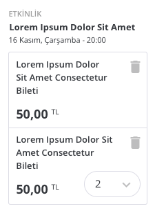

# Dar Sütun, Sepet İçi Ürün

Box office ve benzer alanlarda, seçilmiş ürünleri listelemek için kullanılan bir component'tir. İki tip sepet listesi bulunur, burada tanımlanmış olan dar sütunlarda kullanım için planlanmış sepet içeriğidir.

Ürünler sepete atıldıkları zaman:

- Etkinlik adı (örn: X Filmi)
- O etkinliğe bağlı, tercih edilmiş olan ürün ve ürün adedi (örn: Tam bilet)

... bilgileri ile birlikte gösterilirler. Genel eğilim bir etkinliğe bağlı olarak birden fazla tipte ürün satın almak olduğu için ürünler etkinliğe göre gruplanarak gösterilirler.

Sepet item'ları (bu component) alt alta tekrar edebilirler ve bu liste çok uzun olabilir. Dar sütunda kullanılırken belirli bir adette logical olarak kesilmesi gerekebilir.

## Sergilenen Veriler

Bu component içinde aşağıdaki verilerin gösterilmesi beklenir:

- Etkinlik adı
- Etkinlik yeri ve tarihi
- Ürün listesi, her bir ürün listesi altında:
	- Ürün adı
	- Ürünün fiyatı ve para birimi

Ek olarak, her bir sepet item'ının bir başlığı bulunur. Elimizdeki senaryoya göre şu an başlık olarak "etkinlik" ifadesi belirlenmiştir. Ama ileride ek ürünler (merch, f&b vs.) çıktıkça farklı başlıklar gelebilir, bu alanın yerleşimi değişebilir.

## Sepet İşlevleri

#### Ürün Silebilme

Sepete eklenmiş ürünler silinebilir. Bir etkinliğe bağlı tüm ürünler silinirse, o ürünlerin container'ının da (etkinlik adı ile birlikte) silinmesi gerekir.

Sepet verisi dışarıda tutulacağı için, silme işleminin ürün id'sini içeren bir event emit etmesi gerekir. Bir üstte bu event yakalanarak silme işlemi gerçekleşir.

#### Ürün Adedi Güncelleme

Sistemde iki tip ürün bulunur:

- Özel ayar gerektirenler (örn: yer seçimi)
- Özel ayar gerektirmeyen, direkt eklenebilenler (örn: ayakta konser bileti)

**Özel ayar gerektirmeyen ürünler**, bu durumu belirttikleri için direkt sepet içinden adet güncellemesi yapabilirler. Böyle bir durumda, yeni adet seçildiğinde, seçilmiş olan ürünün id'si ile birlikte yeni adet değeri basılır.

**Özel ayar gerektiren ürünler** ise direkt güncellenemez. Örneğin koltuk seçimi gerektiren bir bilette, adet güncellemesi tetikleyebiliriz ama sistem hangi koltuğu vereceğini bilemeyeceği için bu bilgiyi geçmek yerine dışarı düz bir event atıp, bunun yakalanması ile *bu özel ayarların* girilmesini isteyeceğimiz bir ekrana yönlendirebiliriz.

## Veriler, Parametreler

Component içinde sepet güncellemesi yapılabilecek ise, sepet içinden en az ve en çok ürün olabileceği verisi (selectbox'ı doldurmak için) parametre olarak tüm component'e dışarıdan geçilmelidir.

Eğer bu veri yok ise, ya da null vb. geçilmiş ise, güncelleme selectbox'ı gösterilmez.

### Sepet İçeriği Verisi

Sepet içerikleri her ne kadar etkinlik > ürün şeklinde nested olarak gösterilse de kullanımı bu şekilde olmadığından ötürü flat bir şekilde geçilmeli, içeride etkinliğe göre gruplanmalıdır.
