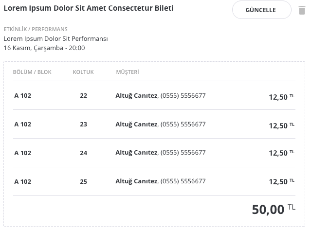
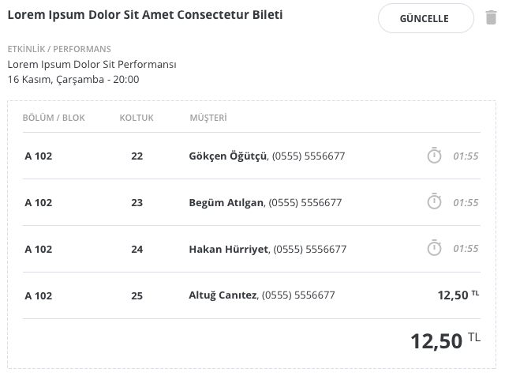
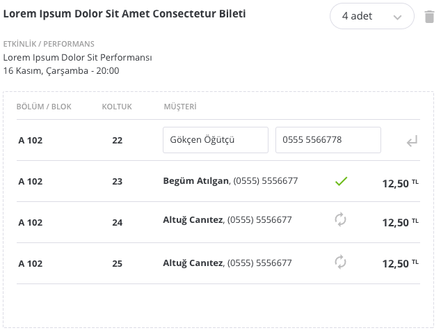

# Geniş Sütun, Sepet İçi Ürün

Box office vb satış ekranlarında kullanılan, sepete eklenmiş ürünlerin detaylarının verildiği gösterimlerdir.

Sepetlerin iki tip gösterimi vardır: [Dar Sütun, Sepet İçi Ürün](narrow-col-basket-item.md) ve geniş gösterim, bu başlıkta geniş gösterim anlatılmaktadır.

## İşleyiş

E-ticaret sitelerinden farklı olarak, bu uygulama sepete atılanlar bağlı oldukları etkinliğe göre gruplanırlar. Örneğin bir filme alınan öğrenci ve tam biletlet farklı ürünler olabilir. Fakat aynı filme alındıkları için birlikte gösterilirler ve işlenirler.

Sepet gösterimi de buna uygun işler. Kullanıcı ürünü sepete eklediği zaman, sepete bağlı olduğu etkinlik de gelir.

### Dar Sepet Gösteriminden Farkları

[Dar Sütun, Sepet İçi Ürün](narrow-col-basket-item.md) ürünleri listelerken etkinliğe göre gruplar ve altına ürün cinslerini yazar.

Geniş gösterim ise, ürünleri listeler, altında bağlı olduğu etkinliği belirtir ve alınmış olan ürün adedi kadar bir satır açar.

**Burada şunlar amaçlanır:**

- Satın alınan her bir giriş hakkı için müşteri seçimi gerekebilir. Kimlik doğrulaması gereken zamanlar olabili, kimlik doğrulaması yasal bir zorunluluk olabilir.
- *Social buying* için kişilerin kimliklerinin belirtilmesi gerekir.

Normal koşullardan burada bir atama yapılmaz ve tüm giriş hakları, satın almayı yapan kişiye ait gösterilir. Sadece gerektiği zaman kullanılır.

## Sergilenen Veriler

Listeleme ürünler üstünden yapılır, her bir ürün bu component'in bir tekrarına karşılık gelir. Bu component içinde aşağıdaki veriler yer alır:

- Ürün adı (örn: X Konseri Tam Bileti)
- Etkinlik bilgileri: Etkinlik adı, yeri ve zamanı
- Ürün adet listesi: Bu liste bir tablonun satırları olarak gösterilir ve bölüm/blok bilgisi, koltuk bilgisi, müşteri bilgisi ve birim fiyattan oluşur. Müşteri bilgisi isim ve telefon olarak gösterilir. Telefon daima maskelenir.

Ek olarak, *ürün adedi numerik olarak bir yerde gösterilir*. Bu bilgi:

- Koltuk seçimi yoksa, dropdown'dan seçilerek
- Koltuk seçimi varsa, "yer seçme" modülüne yönlendirilerek güncellenebilir. Yer seçme modülüne yönlendirme işi bir buton ile olur; dropdown gösterilmez.

### Social-buying Gösterimi

Sistemde grup satın alma işlemleri yapılabilmektedir. Örneğin gişeye gelen bir kişi 4 bilet alıp 2'sini ödeyebilir kalan ikisini ise bir arkadaşı için rezerve edebilir. Bu durumda sistem iki biletlik ödeme alır kalanları ise bloke eder.

Bu işlem, sadece koltuk seçme ekranında yapılmakta birlikte, bilgisi burada değiştirilebilmektedir.

Ayrıca, bloke için kalan süre de kişi adının yanında bir saat ikonu ile birlikte gösterilir.

## Sepet İşlevleri

### Ürün Silebilme

Sepete eklenmiş ürünler silinebilir. Bir ürün silinmek istendiği zaman kullanıcının bir "confirm" ile onaylaması istenir. Ardından component dışına, ürün id'sini içeren bir silme event'i emit edilir. Yukarıda yakalanan bu event ilgili ürün id'sini store'dan silince silme işlemi gerçekleşmiş olur.

### Ürün Adedi Güncelleme

Sistemde iki tip ürün bulunur:

- Özel ayar gerektirenler (örn: yer seçimi)
- Özel ayar gerektirmeyen, direkt eklenebilenler (örn: ayakta konser bileti)

*Özel ayar gerektirmeyen ürünler*, bu durumu belirttikleri için direkt sepet içinden adet güncellemesi yapabilirler. Böyle bir durumda, yeni adet seçildiğinde, seçilmiş olan ürünün id'si ile birlikte yeni adet değeri basılır.

*Özel ayar gerektiren ürünler* ise direkt güncellenemez. Örneğin koltuk seçimi gerektiren bir bilette, adet güncellemesi tetikleyebiliriz ama sistem hangi koltuğu vereceğini bilemeyeceği için bu bilgiyi geçmek yerine dışarı düz bir event atıp, bunun yakalanması ile *bu özel ayarların* girilmesini isteyeceğimiz bir ekrana yönlendirebiliriz.

### Ürün Yönlendirme

Buradan satın alınan biletler, eğer uygun koşullar sağlanmış ise (ödeme sonuç ekranında bir light-switch ile kişiye sorulur) e-mail ya da SMS yolu ile yönlendirilebilir.

Bu durumda, sepette adet gösterimlerinin yanında, her satırda bir ikon ile kişiden alıcı isim, soyisim ve cep telefonu ya da e-mail adresi girmesi istenir. Bu bilgiler girildikten sonra, veriler diğer bilgiler ile birlikte kayıt edilir.

## Veriler, Parametreler

Component içinde sepet güncellemesi yapılabilecek ise, sepet içinden en az ve en çok ürün olabileceği verisi (selectbox'ı doldurmak için) parametre olarak tüm component'e dışarıdan geçilmelidir.

Eğer bu veri yok ise, ya da null vb. geçilmiş ise, güncelleme selectbox'ı gösterilmez.

### Sepet İçeriği Verisi

Sepet verisi component container'da dönülmek suretiyle component'e ürün bilgisi, ürünün bağlı olduğu etkinlik bilgisi ile birlikte geçilir.

Ürünün içinde bulunan giriş hakkı adedi kadar, ürün adet listesi dönülecektir. Kişi bir önceki ekranda yer seçti ise bu bilgilerin de elde olması gerekir. Aynı şekilde kişi bir önceki ekranda her bir yer için bir müşteri ataması yapmış olabilir, bu durumda atanmış müşterilerin de bilgisi burada gösterilmelidir.

Müşteri bilgileri isim-soyisim ve telefon numarasından oluşur. Telefon numaraları daima maskelenerek gösterilir.

Eğer yer seçilmediyse ya da yer seçimi yoksa bu durum kısa çizgi ile işaretlenmelidir. Eğer her bir yer için ayrı müşteri tanımı yoksa, bu durumda tüm koltuklar bileti satın almakta olan kişiye atanmalıdır.

Social-buying adımı işletilmiş ise, ürünler belirli bir süre bloke kalacağı için, bu bilgi de kullanıcıya gösterilmelidir; gösterim işi için birim fiyat sütunu rezerve edilmiştir.